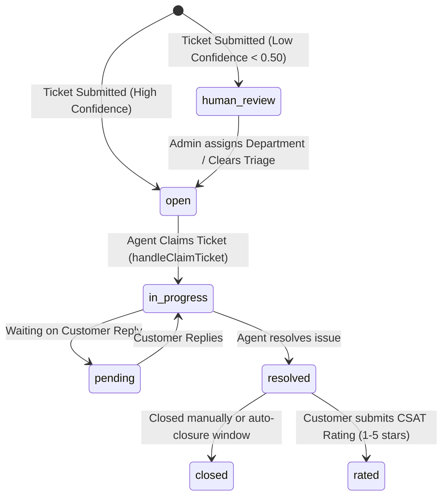

# Deskwise — System Brain & Architecture Playbook (`BRAIN.md`)

> **System Name:** Deskwise (AI-Based Customer Support Ticket System)  
> **Status:** Production-Hardened  
> **Repository Root:** `c:/Users/kolam/Desktop/Projects/Customer-Ticket-System/AI---Based-Customer-Support-Ticket-System`  
> **Primary Interfaces:** FastAPI REST Backend (`:8000`), React + Vite + Tailwind Frontend (`:5173`)  
> **Core Mission:** Automated customer ticket triage, PII-sanitized AI classification, rule-based department routing, strict SLA deadline tracking, and multi-role collaborative resolution.

---

## 1. Executive Summary & Core Invariants

Deskwise is an intelligent customer support platform that blends **local DistilBERT NLP inference** with **deterministic business rules and PostgreSQL storage (Supabase)**. It eliminates manual triage without ceding business logic to unpredictable LLM prompts.

### Non-Negotiable System Invariants

1. **Single-Service Architecture:** Business logic and AI classification run in the same FastAPI Python process. There is no separate microservice or Express layer.
2. **Deterministic vs. AI Boundary:**
   - **AI/Model-Driven:** PII redaction and category/priority classification (DistilBERT).
   - **Deterministic:** Department routing (SQL lookup on predicted category name), SLA calculations (arithmetic based on priority policies), and role enforcement. Never replace deterministic routing or SLA math with a model call.
3. **Zero Raw PII Persistence:** Customer text is scrubbed for emails, phone numbers, and payment cards (`backend/app/ai/redact_pii.py`) **before** it touches the model or database. Raw unredacted text is never logged or saved to disk/database.
4. **Human Review Gate for Low Confidence:** Classifications with confidence `< 0.50` (or `< 0.60` triage threshold) are marked as `needs_human_review` / status `human_review` and routed to the Admin Triage Panel.
5. **Strict Tri-Role Separation (RBAC):** Exactly three roles: `customer`, `agent`, and `admin`.

---

## 2. High-Level Architecture & End-to-End Data Flow

```
┌─────────────────────────────────────────────────────────────────────────┐
│                    Client Tier (React 18 + Vite)                        │
│  • Customer Portal: Submit ticket, track status, add replies, rate      │
│  • Agent Portal: Department queue, claim ticket, reply, SLA countdown   │
│  • Admin Portal: Analytics, triage panel, users, departments, SLA cfg   │
└────────────────────────────────────┬────────────────────────────────────┘
                                      │ HTTPS / REST (Axios Interceptors)
                                      ▼
┌─────────────────────────────────────────────────────────────────────────┐
│                       Backend Tier (FastAPI)                            │
│                                                                           │
│  ┌─────────────────────────────────────────────────────────────────┐   │
│  │ Middleware Layer:                                                │   │
│  │  • CORS (Frontend origin whitelist)                              │   │
│  │  • ForceHTTPSMiddleware & HSTS Security Headers                  │   │
│  │  • SlowAPI Rate Limiter (Redis / In-memory moving window)        │   │
│  │  • Sentry Error Tracking & PII Header Scrubbing                  │   │
│  └────────────────────────────────┬────────────────────────────────┘   │
│                                    │                                     │
│  ┌────────────────────────────────▼────────────────────────────────┐   │
│  │ Security & Auth Dependencies:                                    │   │
│  │  • Supabase JWT verification (Dual: JWKS asymmetric + HS256)     │   │
│  │  • Password-change mandatory gate enforcement                    │   │
│  │  • Role-based guards (require_role: admin, agent, customer)      │   │
│  └────────────────────────────────┬────────────────────────────────┘   │
│                                    │                                     │
│  ┌────────────────────────────────▼────────────────────────────────┐   │
│  │ NLP / AI Pipeline (Internal function calls):                     │   │
│  │  1. redact_pii(text)                                             │   │
│  │  2. classify_ticket(redacted_text)                               │   │
│  │     ├── dept_model: "pratik14212/deskwise-departments"           │   │
│  │     └── priority_model: "pratik14212/deskwise-priorities"        │   │
│  │  3. Department SQL match & SLA policy duration calculation       │   │
│  └────────────────────────────────┬────────────────────────────────┘   │
└───────────────────────────────────┼──────────────────────────────────────┘
                                     │ Async SQLAlchemy 2.0 (asyncpg)
                                     ▼
┌─────────────────────────────────────────────────────────────────────────┐
│                  Database & Identity Tier (Supabase)                    │
│  • Supabase Auth (GoTrue Admin API for agent invites & password reset)  │
│  • PostgreSQL Database (8 Core Tables + Enums + FK Cascades)            │
│  • Transactional Mailer (Brevo API v3 + SMTP Fallback)                  │
└─────────────────────────────────────────────────────────────────────────┘
```

---

## 3. Technology Stack & Key Dependencies

### Backend (`/backend`)
- **Runtime & Web Framework:** Python 3.10+, FastAPI `0.141.1`, Uvicorn `0.52.4`, Starlette
- **ORM & Database Driver:** SQLAlchemy `2.0.52` (async), `asyncpg 0.31.0`
- **Database Migrations:** Alembic `1.19.1`
- **Authentication & Security:** Supabase Python SDK `2.24.0`, PyJWT `2.13.0`, cryptography `50.0.0`, Argon2-cffi `25.1.0`, SlowAPI `0.1.9`
- **Monitoring & Errors:** Sentry SDK `2.68.1`
- **Email Delivery:** Brevo REST API (`api.brevo.com/v3/smtp/email`) + `smtplib` StartTLS fallback

### AI & Machine Learning (`/backend/app/ai`)
- **Inference Engines:** PyTorch `torch`, Hugging Face `transformers`, `tokenizers`, `huggingface_hub`
- **Base Architecture:** `DistilBertForSequenceClassification` + `DistilBertTokenizerFast`
- **Pretrained Repositories:**
  - Department Model: `pratik14212/deskwise-departments` (7 classes)
  - Priority Model: `pratik14212/deskwise-priorities` (3 classes: `high`, `medium`, `low`)
- **Training Script:** `train.py` (Multi-task PyTorch trainer with macro-F1 evaluation)

### Frontend (`/frontend`)
- **Framework & Tooling:** React 18 (`18.3.1`), Vite `5.4.8`
- **Styling & UI:** Tailwind CSS `3.4.13`, PostCSS, Lucide React icons (`0.446.0`)
- **Routing & Networking:** React Router v6 (`6.26.2`), Axios (`1.15.1`) with JWT request/response interceptors
- **Date Formatting:** `date-fns 3.6.0`

---

## 4. Database Schema & Relational Model

The database is deployed on PostgreSQL via Supabase and managed using Alembic migrations.

### Core Enums
- **`user_role`**: `'customer'`, `'agent'`, `'admin'`
- **`agent_tier`**: `1` (regular), `2` (super_agent)
- **`ticket_priority`**: `'low'`, `'medium'`, `'high'`
- **`ticket_status`**: `'open'`, `'in_progress'`, `'pending'`, `'resolved'`, `'closed'`
- **`ticket_sentiment`**: `'positive'`, `'neutral'`, `'negative'`

### Entity Relationship Model

| Table | Primary Key | Key Columns & Relations | Description |
|---|---|---|---|
| **`users`** | `id` (UUID) | `email` (unique), `password_hash`, `role` (`user_role`), `department_id` (FK `departments.id` `ON DELETE SET NULL`), `agent_tier`, `must_change_password` (bool), `phone_number`, `first_name`, `last_name`, `invited_at`, `invited_by` | System accounts. Synced with Supabase Auth identities. |
| **`departments`** | `id` (UUID) | `name` (unique text) | Departments handling tickets (e.g., Technical Operations, Billing & Finance). |
| **`categories`** | `id` (UUID) | `name` (unique text) | Legacy/granular issue categories. |
| **`tickets`** | `id` (UUID) | `customer_id` (FK `users.id` `ON DELETE CASCADE`), `department_id` (FK `departments.id` `ON DELETE SET NULL`), `assigned_agent_id` (FK `users.id` `ON DELETE SET NULL`), `priority`, `sentiment`, `status`, `subject`, `body_redacted`, `classification_confidence` (numeric 4,3), `created_at`, `updated_at` | Primary ticket records storing sanitized subject/body and AI confidence. |
| **`sla_policies`** | `id` (UUID) | `priority` (`ticket_priority`, unique), `response_minutes` (int), `resolution_minutes` (int) | Target SLAs by priority (e.g. High: 60m response, 480m resolution). |
| **`sla_state`** | `id` (UUID) | `ticket_id` (FK `tickets.id` `ON DELETE CASCADE`, unique), `sla_policy_id` (FK `sla_policies.id` `ON DELETE CASCADE`), `response_due_at`, `resolution_due_at`, `first_response_at`, `resolved_at`, `breached` (bool), `escalated_at` | Tracks exact countdown deadlines, breach states, and escalation flags. |
| **`replies`** | `id` (UUID) | `ticket_id` (FK `tickets.id` `ON DELETE CASCADE`), `author_id` (FK `users.id` `ON DELETE SET NULL`), `is_auto_reply` (bool), `is_internal_note` (bool), `body` (text), `created_at` | Conversation thread. Supports customer replies, agent replies, and private internal notes. |
| **`attachments`** | `id` (UUID) | `ticket_id` (FK `tickets.id` `ON DELETE CASCADE`), `filename`, `original_filename`, `content_type`, `file_size` (bigint), `created_at` | Metadata for files stored on disk under `uploads/{ticket_id}/`. |
| **`ticket_ratings`**| `id` (UUID) | `ticket_id` (FK `tickets.id` `ON DELETE CASCADE`, unique), `rating` (int 1-5), `feedback` (text), `created_at` | Post-resolution CSAT surveys submitted by customers. |

---

## 5. Security & Authentication Architecture

### 1. Dual JWT Verification (`backend/app/core/security.py`)
- Fast token validation without round-tripping to Supabase for every request.
- **Asymmetric (Primary):** Pulls JWKS public keys from `{SUPABASE_URL}/auth/v1/.well-known/jwks.json` (cached with double-checked thread lock for 600s). Verifies `RS256` / `ES256` signatures against audience `"authenticated"`.
- **Symmetric (Fallback):** Supports `HS256` tokens signed with `SUPABASE_JWT_SECRET`.
- **Token Classification Errors:** Explicitly differentiates between `TokenExpiredError` (triggers client refresh), `TokenMissingSubjectError` (blocks raw anon/service keys), and `TokenInvalidError`.

### 2. Frontend Axios Interceptor Mutex (`frontend/src/services/api.js`)
- Request interceptor attaches `Authorization: Bearer <access_token>`.
- Intercepts `401 Unauthorized` responses:
  - Sets an `isRefreshing` mutex lock.
  - Queues concurrent failing requests in a `failedQueue`.
  - Sends a refresh request with `refresh_token` to `POST /auth/refresh`.
  - Replays all queued requests with the renewed bearer token.

### 3. Invited Agent Password Lifecycle
- Admins invite agents via `POST /users/invite-agent`.
- Domain Whitelist: Agents must belong to authorized company domains:
  - `ritgoa.ac.in`
  - `aiemgoa.ac.in`
  - `pccegoa.edu.in`
- An agent account is created in Supabase Auth with a temporary password and `must_change_password = True`.
- Transactional invitation email is dispatched via Brevo.
- On first login, any request outside of `PASSWORD_CHANGE_EXEMPT_PATHS` (`/auth/change-password`, `/auth/me`, etc.) receives `403 Forbidden ("Password change required")`, redirecting the user to `/change-password`.

---

## 6. AI & Machine Learning Pipeline

```
Raw Customer Input
        │
        ▼
[1. PII Redaction: redact_pii(text)]
    ├── Regex: Emails → "<email>"
    ├── Regex: Credit/Debit Cards (13-19 digits) → "<acc_num>"
    └── Regex: Phone Numbers (7+ digits) → "<tel_num>"
        │
        ▼
[2. DistilBERT Tokenization & Inference: classify_ticket(subject, body)]
    ├── Text Format: "{subject}. {body}" (max length 128 tokens)
    ├── Model 1: Department Classifier (7 classes) → predicted_dept, confidence
    └── Model 2: Priority Classifier (3 classes: high, medium, low) → predicted_priority
        │
        ▼
[3. Confidence Check & Triage Routing]
    ├── Confidence >= 0.50 (and >= 0.60):
    │     • status = "open"
    │     • department_id = Matched Department ID
    │     • priority = AI predicted priority
    └── Confidence < 0.50 / Department Unmatched:
          • status = "human_review"
          • Flagged in Admin Triage Queue (needs_triage=True)
```

### Department Label Mappings (`backend/app/ai/label_mappings.json`)

```json
{
  "department": {
    "Administration & People": 0,
    "Billing & Finance": 1,
    "Customer Experience": 2,
    "Product Operations": 3,
    "Sales & Growth": 4,
    "Service Reliability": 5,
    "Technical Operations": 6
  },
  "priority": {
    "high": 0,
    "low": 1,
    "medium": 2
  }
}
```

---

## 7. Ticket Lifecycle & SLA Engine

### State Machine Transitions



### SLA Matrix (`backend/scripts/seed.py`)

| Priority | Response Due | Resolution Due |
|---|---|---|
| **Low** | 480 minutes (8 hrs) | 4,320 minutes (72 hrs) |
| **Medium** | 240 minutes (4 hrs) | 1,440 minutes (24 hrs) |
| **High** | 60 minutes (1 hr) | 480 minutes (8 hrs) |

Frontend `SLAWatcher.jsx` monitors the countdown against `sla_due_at`, displaying color-coded warning indicators when deadlines approach breach.

---

## 8. Frontend Portal Architecture

The frontend is a single-page React app providing tailored workflows based on the user's role:

| Role | Primary Routes | Capabilities & Screens |
|---|---|---|
| **Customer** | `/tickets/new`<br>`/tickets`<br>`/tickets/history`<br>`/tickets/:id` | • File ticket with multi-file drag-and-drop attachments.<br>• Real-time ticket status tracking & conversation view.<br>• Star-rating modal with CSAT feedback upon ticket resolution. |
| **Agent** | `/agent/ticket-panel`<br>`/agent/tickets/:id`<br>`/agent/analytics` | • Department Queue ("Assigned to Me" vs. "Unassigned Department Tickets").<br>• Self-claim ticket action with automated internal note audit trail.<br>• Rich reply editor with toggleable Internal Notes and Canned Replies.<br>• Performance dashboard: resolution rates, assigned ticket counts, CSAT. |
| **Admin** | `/admin/analytics`<br>`/admin/ticket-panel`<br>`/admin/settings` | • Executive KPI overview: SLA compliance %, volume trends, category breakdowns.<br>• Triage Queue (`needs_triage=True`) to reassign low-confidence tickets.<br>• User management & Agent invitation form (with domain validation).<br>• Department and SLA policy duration configuration. |

### Real-Time Polling & Notification Engine
- **Queue Freshness:** `AgentTicketPanel` and `AdminTicketPanel` poll every 15 seconds to refresh queues.
- **Notification Engine:** `NotificationContext.jsx` runs a 30-second ticket diff polling loop, detecting status changes and new replies, persisting unread counters to `localStorage`.

---

## 9. API Endpoints Catalog

### `/auth` (Authentication & Profile)
- `POST /auth/signup` — Public customer registration.
- `POST /auth/login` — User authentication returning JWT bearer and refresh cookie.
- `POST /auth/refresh` — Issue fresh access token using refresh token.
- `POST /auth/logout` — Revoke session and clear cookies.
- `GET /auth/me` / `PUT /auth/me` — Read and update current user profile.
- `POST /auth/change-password` — Obligatory password change for new agents.
- `POST /auth/forgot-password` — Dispatches 15-minute reset link via Brevo.
- `GET /auth/verify-reset-token` — Validate reset token before rendering UI.
- `POST /auth/reset-password` — Commit new password.

### `/tickets` (Core Ticket Management)
- `POST /tickets/` — Submit new ticket (executes PII redaction + AI classification).
- `GET /tickets/` — List tickets with role-based filtering, status, priority, department, and `needs_triage` parameters.
- `GET /tickets/{id}` — Fetch ticket details, customer email, SLA deadline, and attachments.
- `PUT /tickets/{id}` — Update ticket attributes (status, department, agent assignment).
- `DELETE /tickets/{id}` — Admin delete ticket.
- `POST /tickets/{id}/attachments` — Upload files (max 5MB, whitelisted extensions).
- `GET /tickets/{id}/attachments` — List attachments for ticket.
- `GET /tickets/{id}/attachments/{filename}` — Download attachment file.
- `POST /tickets/{id}/rate` — Submit CSAT rating (1-5) and feedback.
- `GET /tickets/analytics` — Admin KPI overview metrics.
- `GET /tickets/analytics/agent` — Individual agent performance statistics.

### `/replies` (Conversation Thread)
- `POST /replies/` — Post customer reply, agent reply, or private internal note.
- `GET /replies/ticket/{ticket_id}` — Chronological conversation stream.
- `DELETE /replies/{id}` — Admin delete reply.

### `/users` (Team & Administration)
- `POST /users/invite-agent` — Admin invites an agent (generates temp password, sends email).
- `GET /users/` — Admin list users.
- `GET /users/{id}` / `PUT /users/{id}` / `DELETE /users/{id}` — Admin CRUD on users.

### `/departments` & `/sla-policies`
- `GET /departments/` — List active departments with open ticket counts.
- `POST` / `PUT` / `DELETE /departments/{id}` — Admin department management.
- `GET` / `PUT /sla-policies/{id}` — SLA target hours and minutes management.

---

## 10. Operations & Developer Runbook

### Local Environment Setup

**1. Backend Setup**
```bash
# Activate virtual environment
.venv\Scripts\activate

# Install dependencies
pip install -r requirements.txt

# Run Alembic migrations
alembic upgrade head

# Seed initial departments, SLA policies, and default admin
python -m backend.scripts.seed

# Start FastAPI server
uvicorn backend.app.main:app --reload --port 8000
```

**2. Frontend Setup**
```bash
# Install NPM dependencies
npm install

# Start Vite dev server
npm run dev
```

**3. Verification & Tests**
```bash
# Run FastAPI smoke test
python smoke_test.py

# Run AI classification test suite
python quick_test.py

# Run unit and regression tests
pytest backend/tests
```

**4. Model Retraining & Hugging Face Synchronization**
```bash
# Train multitask classifier
python -m backend.app.ai.train \
  --train-file data/combined/train.jsonl \
  --eval-file data/combined/valid.jsonl \
  --output-dir backend/app/ai/model_artifacts_candidate \
  --epochs 3 --tasks category priority --seed 42

# Upload fine-tuned model artifacts to Hugging Face Hub
hf auth login
hf upload pratik14212/deskwise-departments backend/app/ai/models/department .
hf upload pratik14212/deskwise-priorities backend/app/ai/models/priority .
```

---

## 11. Key File Locations Reference

| File | Role |
|---|---|
| `backend/app/main.py` | FastAPI entry point, middleware assembly, router mounting, static upload mounting. |
| `backend/app/config.py` | Pydantic Settings loading `.env` (Supabase, Brevo, Sentry, Rate limits). |
| `backend/app/database.py` | Async SQLAlchemy engine, session maker, connection pool lifecycle. |
| `backend/app/dependencies.py` | Security dependencies: Bearer token parsing, current user resolution, role checking. |
| `backend/app/core/security.py` | Supabase JWKS cache, JWT decoding, token error handling. |
| `backend/app/core/mailer.py` | Brevo API & SMTP client, HTML email templates for invites and password resets. |
| `backend/app/ai/redact_pii.py` | Regex PII scrubbing engine for emails, phones, and credit card numbers. |
| `backend/app/ai/classify_ticket.py` | DistilBERT model loading, tokenization, inference, and confidence scoring. |
| `backend/app/routers/tickets.py` | Ticket creation, AI classification hook, queue filtering, attachments, CSAT. |
| `frontend/src/App.jsx` | Client-side routing, role-based route guarding, layout assembly. |
| `frontend/src/services/api.js` | Axios client with JWT refresh queue interceptor. |
| `frontend/src/context/AuthContext.jsx` | Global authentication state, session bootstrap, password-change gate handler. |
| `frontend/src/context/NotificationContext.jsx` | Real-time polling ticket diff detector. |